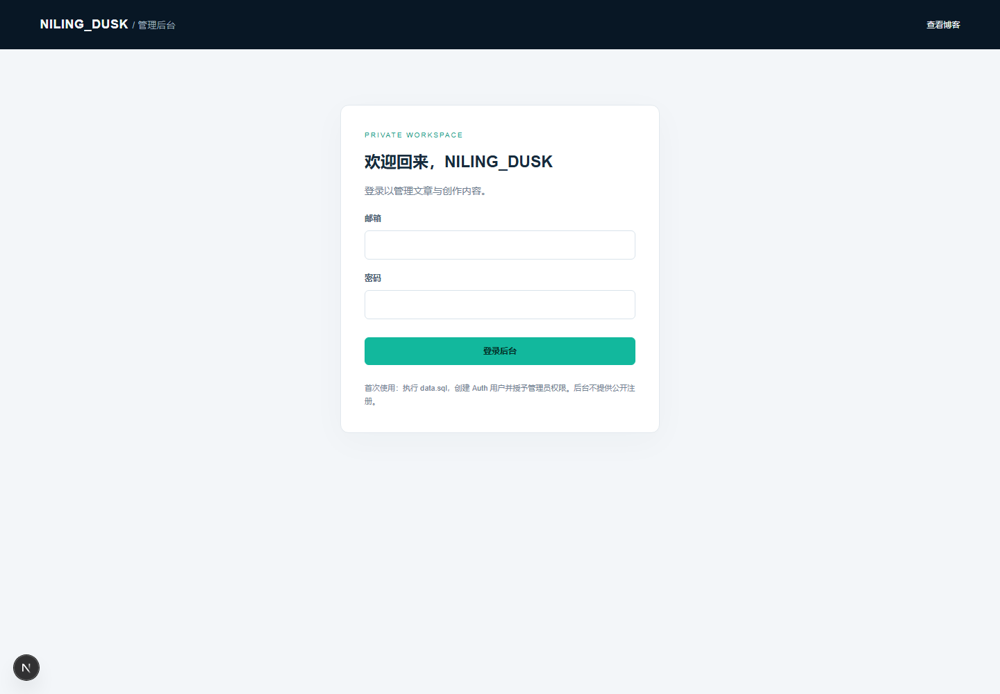
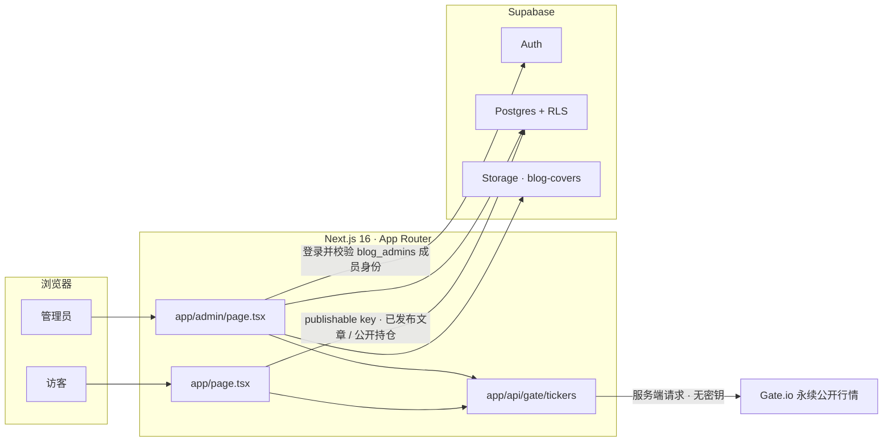

<div align="center">


# NILING_DUSK

**Crypto · Stocks · Engineering**

记录思考，让成长发生。

[](https://nextjs.org)
[](https://react.dev)
[](https://www.typescriptlang.org)
[](https://tailwindcss.com)
[](https://supabase.com)
[](https://vercel.com)

一个面向「加密货币 · 美股 · 软件工程」的个人博客站。<br />
前台是克制的阅读体验，后台是一套带行级安全策略的内容与持仓管理系统。

[功能特性](#-功能特性) · [界面预览](#-界面预览) · [架构](#-架构) · [快速开始](#-快速开始) · [环境变量](#-环境变量) · [权限模型](#-权限与安全模型) · [项目结构](#-项目结构) · [部署](#-部署到-vercel) · [常见问题](#-常见问题)

</div>

---

## ✨ 功能特性

<table>
<tr>
<td width="50%" valign="top">

### 📖 访客前台

- **文章流** — 只读取 `status = published` 的文章，按发布时间倒序
- **分类浏览** — 最新文章 / 加密货币 / 美股 / 软件工程 / 生活随笔
- **关键词搜索** — 同时匹配标题、摘要与正文
- **Markdown 阅读** — 弹窗内渲染 GFM 表格、任务列表、代码块与图片
- **阅读时长估算** — 按正文长度自动折算
- **深浅色主题** — 一键切换，配色随主题联动
- **实时行情标签** — 首屏展示 Gate 永续合约价格，15 秒刷新
- **持仓概览** — 侧栏卡片显示总市值，点击查看逐项详情
- **开场动画** — 约 3.6 秒，可跳过，遵循系统减少动效偏好

</td>
<td width="50%" valign="top">

### 🛠️ 管理后台

- **邮箱密码登录** — Supabase Auth，非管理员账号直接拒绝
- **文章增删改查** — 草稿 / 已发布、唯一路径、摘要与分类
- **Markdown 编辑器** — 工具栏插入语法、实时预览、语法速查表
- **本地自动缓存** — 防抖写入 localStorage，意外关闭后可恢复
- **离开提醒** — 有未保存改动时拦截页面关闭
- **封面上传** — 外部 HTTPS 链接，或上传到 Supabase Storage 图床
- **持仓录入** — 资产、账户、数量、入场价、杠杆、方向、是否公开
- **自动带价** — 输入资产代码即从服务端带出当前价格
- **收益率计算** — 以入场价为基准、按杠杆放大，30 秒刷新

</td>
</tr>
</table>

### 🔍 值得一提的实现细节

| 细节 | 做法 |
| --- | --- |
| **不解析原始 HTML** | Markdown 渲染统一开启 `skipHtml`，从源头规避脚本注入 |
| **浏览器不接触行情密钥** | 前端只请求站内 `/api/gate/tickers`，由服务端去取公开行情 |
| **行情路由防滥用** | 资产代码须匹配 `^[A-Z0-9]{2,20}$`，单次最多 20 个，8 秒超时 |
| **收益率只有一份口径** | 前后台共用 `lib/portfolio.ts`，避免两处算法漂移 |
| **持仓市值由数据库生成** | `value_usd` 是 `generated always as ... stored` 生成列 |
| **数据库脚本幂等** | `data.sql` 可重复执行，不会删除或覆盖已有文章 |

---

## 🖼 界面预览

<div align="center">


<sub><b>首页</b> — 编辑式排版、实时的 BTC 永续行情，以及按分类组织的文章流</sub>

<br /><br />



<sub><b>管理后台</b> — 受 Auth 会话与 RLS 双重保护的非公开工作区</sub>

<br /><br />

<details>
<summary><b>开场动画</b>（点击展开）</summary>
<br />

<br />
<sub>约 3.6 秒的全屏开场，可点击跳过或按 <kbd>Esc</kbd> 关闭；检测到 <code>prefers-reduced-motion</code> 时不播放，JavaScript 不可用时也不会阻挡页面。</sub>
</details>

</div>

---

## 🧱 技术栈

| 层面 | 选型 | 说明 |
| --- | --- | --- |
| 框架 | **Next.js 16.3.5**（App Router） | 页面与 Route Handler 同仓，行情中继直接放在 `app/api` |
| UI | **React 19.2** + **TypeScript 5** | 全量类型标注，持仓与文章都有共享类型 |
| 样式 | **Tailwind CSS 4** + 原生 CSS | 设计变量集中在 `globals.css`，深浅色共用一套 token |
| 数据 | **Supabase Postgres** | 行级安全策略承担全部鉴权，客户端只持有 publishable key |
| 鉴权 | **Supabase Auth** | 邮箱密码登录，管理员身份由 `blog_admins` 表决定 |
| 存储 | **Supabase Storage** | `blog-covers` 公开图床，限制 MIME 与 5MB 体积 |
| Markdown | **react-markdown 10** + **remark-gfm 4** | GFM 表格、任务列表、代码块；始终 `skipHtml` |
| 行情 | **Gate.io 永续合约公开接口** | 公开行情，无需 API Key，不落库 |

---

## 🏗 架构



**两条数据路径互相独立**：访客前台只用 publishable key 直连 REST 读公开数据，不依赖登录态；后台则依赖 Auth 会话，再由 RLS 判定每一次写入。

---

## 🚀 快速开始

**前置要求**

| 依赖 | 版本 |
| --- | --- |
| Node.js | `>= 20.9.0`（Next.js 16 要求） |
| npm | 随 Node 安装即可 |
| Supabase 项目 | 免费版足够 |

**三步跑起来**

```bash
# 1. 安装依赖
npm install

# 2. 配置环境变量（见下一节）
cp .env.example .env.local     # Windows: copy .env.example .env.local

# 3. 启动开发服务器
npm run dev
```

打开 <http://localhost:3000> 查看首页，<http://localhost:3000/admin> 进入后台。

**可用脚本**

| 命令 | 作用 |
| --- | --- |
| `npm run dev` | 启动开发服务器 |
| `npm run build` | 生产构建 |
| `npm start` | 运行生产构建 |
| `npm run lint` | ESLint 检查 |

---

## 🔑 环境变量

复制 `.env.example` 为 `.env.local` 后填写：

| 变量 | 必填 | 说明 |
| :--- | :---: | :--- |
| `NEXT_PUBLIC_SUPABASE_URL` | ✅ | Supabase 项目根 URL。**不要**带 `/rest/v1` 后缀 |
| `NEXT_PUBLIC_SUPABASE_PUBLISHABLE_KEY` | ✅ | 项目 publishable key，会被打包进浏览器代码 |
| `GATE_SETTLE` | ⭕ | Gate 永续合约结算币种，默认 `usdt` |

> [!IMPORTANT]
> 任何 `service_role`、secret key 或数据库密码都**不能**加 `NEXT_PUBLIC_` 前缀，也不能出现在这个项目的客户端代码里。publishable key 本身不赋予管理员权限——真正的边界是 `data.sql` 里的 RLS 策略。

---

## 🗄 数据库初始化

完整 SQL 位于 [`data.sql`](./data.sql)，**可重复执行**，不会删除或覆盖已有文章。

```text
1. 在 Supabase → Authentication → Users 中创建管理员账号（确认邮箱）
2. 打开 data.sql，把末尾 admin_email 改成你的邮箱
3. 在 Supabase SQL Editor 中，确认执行角色为 postgres，一次性执行整份脚本
```

脚本会一次完成：建表 → 索引 → `updated_at` 触发器 → `is_blog_admin()` 函数 → RLS 策略 → 公开文章读取权限 → `blog-covers` 图床 → 管理员授权。

<details>
<summary><b>数据模型一览</b></summary>
<br />

**`blog_admins`** — 管理员名单，`user_id` 外键指向 `auth.users`

**`blog_posts`** — 文章主表，字段级约束把校验前移到数据库

| 字段 | 约束 |
| --- | --- |
| `title` | 长度 1–200 |
| `slug` | 唯一，须匹配 `^[a-z0-9]+(-[a-z0-9]+)*$` |
| `excerpt` | 长度 ≤ 500 |
| `category` | 枚举：加密货币 / 美股 / 软件工程 / 生活随笔 |
| `content` | 长度 ≤ 200000 |
| `cover_url` | 空串，或以 `https://` 开头 |
| `status` | 枚举：`draft` / `published` |

**`portfolio_holdings`** — 持仓表

- `source` 为 `gate` 或 `manual`；`direction` 为 `long` 或 `short`
- `value_usd` 是生成列：`amount * price_usd`，`price_usd` 为空时结果也为空
- `(owner_id, source, account, asset)` 组合唯一，避免重复同步
- `avg_price_usd`、`mark_price_usd`、`entry_price_usd` 均带非负校验，`leverage` 须大于 0

</details>

---

## 🔐 权限与安全模型

鉴权全部下沉到数据库，前端不承担安全职责。执行 `data.sql` 后建议用三个身份逐一验证：

| 身份 | 读取 | 写入 | 上传封面 |
| --- | --- | :---: | :---: |
| **未登录访客** | 仅 `published` 文章、仅 `is_public = true` 的持仓 | ❌ | ❌ |
| **普通 Auth 用户** | 仅 `published` 文章；`blog_admins` 中只能看到自己那一行 | ❌ | ❌ |
| **`blog_admins` 成员** | 全部文章与持仓 | ✅ | ✅ |

几个关键设计：

- **`is_blog_admin()` 是 `security definer` 函数**，并固定 `search_path = ''`，避免策略被搜索结果劫持
- **管理员成员表对 `anon` 完全撤销权限**，`authenticated` 也仅能读自己那一行
- **图床目录按 `auth.uid()` 隔离**，上传路径的第一段必须是本人 id
- **只读文章不需要登录** —— 访客读已发布文章是公开策略，不经过后台会话

撤销管理员只需删除 `blog_admins` 中对应记录，后续数据库请求立即受限，无需改动任何代码或重新部署。

---

## 📈 持仓与实时行情

持仓在后台**手动录入**，实时价格由服务端从 Gate 永续合约公开接口获取——**不需要 Gate API Key**。

**收益率口径**（保证金视角，前后台完全一致）：

```text
多仓 = (实时价 − 入场价) / 入场价 × 杠杆倍数
空仓 = (入场价 − 实时价) / 入场价 × 杠杆倍数
```

价格取值使用「实时价优先、保存价兜底」的回退策略：

```ts
// lib/portfolio.ts
export function markPrice(holding: Holding, marks: LiveMarks): number | null {
  return marks[holding.asset] ?? holding.price_usd ?? null;
}
```

| 位置 | 刷新频率 |
| --- | --- |
| 首页行情标签（BTC / ETH） | 15 秒 |
| 首页持仓卡片与详情弹窗 | 15 秒 |
| 后台持仓列表 | 30 秒 |

> [!NOTE]
> 行情不可用时页面不会报错：标签保持静默，持仓收益率显示为 `—`，并自动回退到保存时的价格。

---

## 📁 项目结构

```text
blog/
├─ app/
│  ├─ page.tsx                    # 首页：文章流、分类、搜索、持仓卡片与弹窗
│  ├─ opening.tsx                 # 开场动画（可跳过 · 尊重减少动效偏好）
│  ├─ layout.tsx                  # 根布局与站点元信息
│  ├─ globals.css                 # 全站样式与深浅色设计变量
│  ├─ admin/
│  │  ├─ page.tsx                 # 后台：登录、文章 CRUD、持仓录入
│  │  ├─ layout.tsx
│  │  └─ admin.css
│  └─ api/
│     └─ gate/tickers/route.ts    # Gate 永续行情服务端中继
├─ lib/
│  ├─ portfolio.ts                # 持仓类型与收益率口径（前后台共用）
│  └─ supabase.ts                 # 浏览器端 Supabase 客户端
├─ public/                        # 站点图片资源
├─ docs/                          # 本 README 的预览图
├─ data.sql                       # 数据库一键初始化：表 / 索引 / 触发器 / RLS / 图床
├─ ADMIN_SETUP.md                 # 后台初始化与权限核验清单
└─ .env.example                   # 环境变量模板
```

---

## ☁️ 部署到 Vercel

1. 把仓库导入 Vercel
2. 在 **Environment Variables** 中添加 `NEXT_PUBLIC_SUPABASE_URL` 与 `NEXT_PUBLIC_SUPABASE_PUBLISHABLE_KEY`，并勾选 Production / Preview / Development
3. 在 Supabase **Authentication → URL Configuration** 中，把 Vercel 正式域名加入 Site URL 与 Redirect URLs

```text
NEXT_PUBLIC_SUPABASE_URL=https://YOUR_PROJECT_REF.supabase.co
NEXT_PUBLIC_SUPABASE_PUBLISHABLE_KEY=YOUR_SUPABASE_PUBLISHABLE_KEY
GATE_SETTLE=usdt
```

`.env.local` 已被 Git 忽略；仓库里只提交不含真实值的 `.env.example`。

---

## ❓ 常见问题

<details>
<summary><b>首页一直没有文章？</b></summary>
<br />
文章必须是「已发布」状态才会出现在前台。改成草稿后不再对新请求开放。
</details>

<details>
<summary><b>后台提示「数据库尚未初始化，请先执行 data.sql」？</b></summary>
<br />
说明表还不存在。请在 Supabase SQL Editor 中以 <code>postgres</code> 角色执行完整的 <code>data.sql</code>。
</details>

<details>
<summary><b>登录成功却提示没有管理员权限？</b></summary>
<br />
该账号不在 <code>blog_admins</code> 中。先确认 Auth 用户已创建，再检查 <code>data.sql</code> 末尾的 <code>admin_email</code> 是否为你的邮箱，然后重新执行脚本。
</details>

<details>
<summary><b>持仓收益率显示为「—」？</b></summary>
<br />
两种可能：入场价未填写，或 Gate 上没有对应的永续合约。收益率同时依赖入场价与实时价，缺一即为空。
</details>

<details>
<summary><b>上传封面失败？</b></summary>
<br />
图床只接受 JPEG / PNG / WebP / GIF，且不超过 5MB，禁止 SVG。粘贴外链时必须是 <code>https://</code> 开头。
</details>

<details>
<summary><b>删除文章后，图床里的文件为什么还在？</b></summary>
<br />
这是有意为之——同一张封面可能被多篇文章引用，自动删除会破坏其他引用。未使用的文件可在 Supabase Storage 控制台手动清理。
</details>

<details>
<summary><b>为什么一定要用 publishable key，而不是 service_role？</b></summary>
<br />
<code>service_role</code> 会绕过全部 RLS 策略。一旦加进 <code>NEXT_PUBLIC_</code> 变量就会被打包进浏览器代码，等于把数据库完全公开。
</details>

---

## 🧭 已知边界

当前版本的明确留白，避免误解：

- **邮件订阅尚未接入** —— 表单已就位，提交后只返回占位提示
- **没有独立的文章路由** —— `slug` 已入库且唯一，但阅读目前通过首页弹窗完成，尚无 `/posts/[slug]` 页面
- **无自动化测试** —— 尚无测试框架，权限变更后建议按「权限与安全模型」逐角色手工核验
- **未声明开源许可证** —— 仓库暂未附带 LICENSE 文件

---

<div align="center">

### NILING_DUSK

*Better Ideas. Higher Compound.*

**Stop-losses keep you in the game; take-profits decide how you win it.**

<sub>© 2026 NILING_DUSK</sub>

</div>
